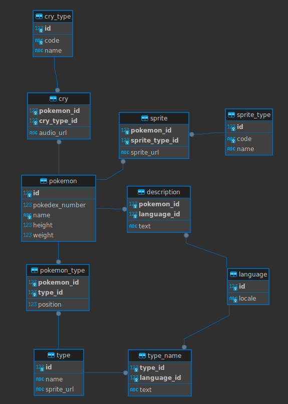

# Installation

Installer docker : https://docs.docker.com/engine/install/

Dans le repertoire du projet, lancer `./run.sh init` (verifier que le script run.sh soit executable, sinon lancer `chmod +x ./run.sh`)

Aller sur http://127.0.0.1:8081 pour verifier que l'installation est réussie

### Lancer les tests

Pour lancer les tests, exécuter la commande suivante :

```bash
$ docker compose exec apimon_php php artisan test
```

# Exercice

L'exercice consite à faire 2 APIs, une API de listing des pokemon et une API d'information sur un pokemon donné.

Une documentation swagger est disponible ici: http://127.0.0.1:8081/api/documentation

Le controller `src/app/Http/Controllers/Api/PokemonController.php` est déjà existant, ainsi que les routes de l'API

### API de listing des pokemon

L'API prend en parametre de requete un offset ainsi qu'une limite pour la pagination

Exemple: http://127.0.0.1:8081/api/pokemons?offset=0&limit=10

Elle doit retourner une reponse json contenant:
* total: le nombre total de pokemon
* prev: l'url de la page de pagination précédente (si applicable)
* next: l'url de la page de pagination suivante (si applicable)
* results: un tableau contenant les resultats (voir le swagger)

### API de description d'un pokemon

L'API prend en parametre un id de pokemon

Exemple: http://127.0.0.1:8081/api/pokemons/1

Elle doit retourner une reponse json contenant la description du pokemon (voir le swagger)

#### Gestion du language

Les noms, descriptions, noms des types doivents être retournes en fonction de la locale presente dans le header `Accept-Language` des requetes API (en, fr).
Si un nom, une description, ou un nom de type n'a pas de traduction dans la langue voulue, retourner la traduction anglaise si disponible, null sinon

(Tips: le pokemon id 1302 n'a pas de description française)

# Base de données



#### pokemon
Les informations de base des pokemon

#### cry
Cris des pokemon

#### cry_type
Type des cris

#### types
Cris des pokemon

#### name
Noms des pokemon par langues (en et fr)

#### description
Description des pokemon par langues (en et fr)

#### pokemon_type
Table de jointure entre pokemon et type

#### type_name
Nom des types par langues (en et fr)

#### sprite
Sprites (images) des pokemons

#### sprite_type
Type des sprites

#### language
Languages disponibles